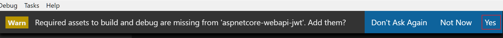

# aspnetcore-webapi-jwt


```
dotnet new webapi

cd ProjectName

code .
```

Enable the vscode build & debug configuration 


```
dotnet restore
```

Next, let's add following packages to our Web API project.

```
dotnet add package Microsoft.EntityFrameworkCore.Tools --version 2.0.1

dotnet add package Microsoft.EntityFrameworkCore.Sqlite --version 2.0.1

dotnet add package Microsoft.EntityFrameworkCore.Tools.DotNet --version 2.0.1
```

Open the .csproj file and add following Package and CLiToolReference. Unfortunately there is no CLI support yet to add CLiToolReference item using command line.

```
<DotNetCliToolReference Include="Microsoft.EntityFrameworkCore.Tools.DotNet" Version="2.0.1" />
```

Next restore newly referred packages with `dotnet restore`


dotnet ef migrations add initial

dotnet ef database update


dotnet restsore

