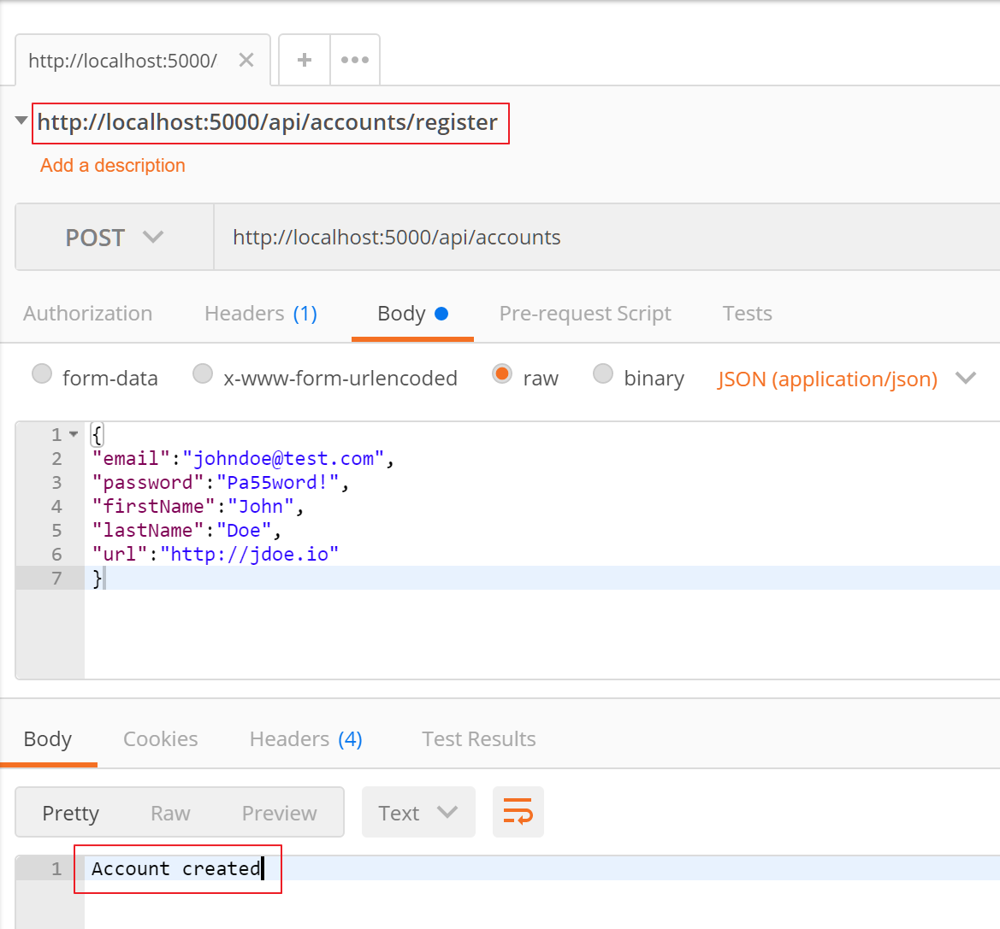
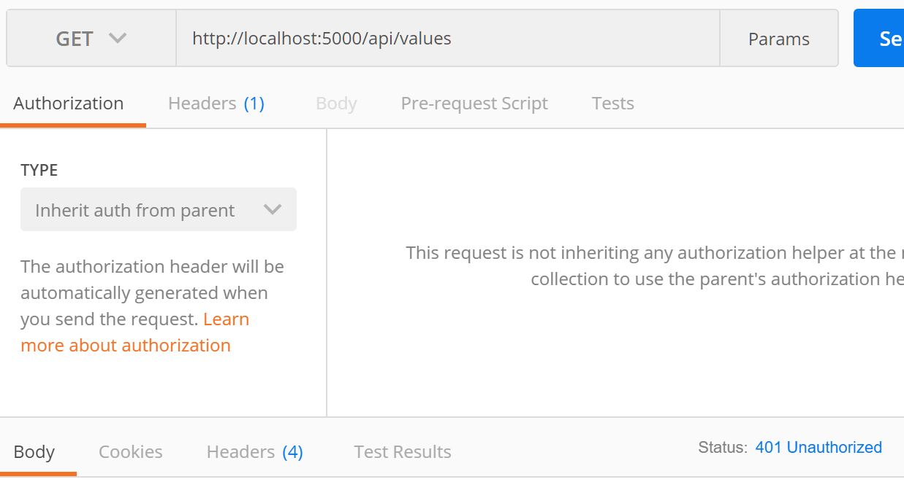
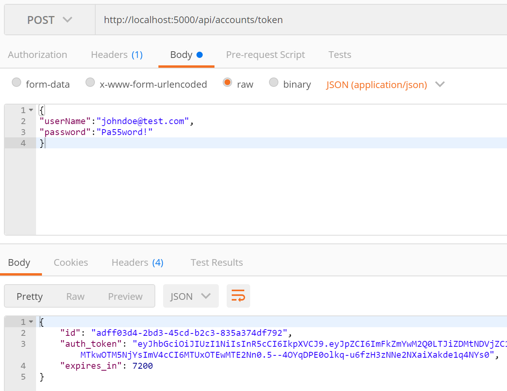
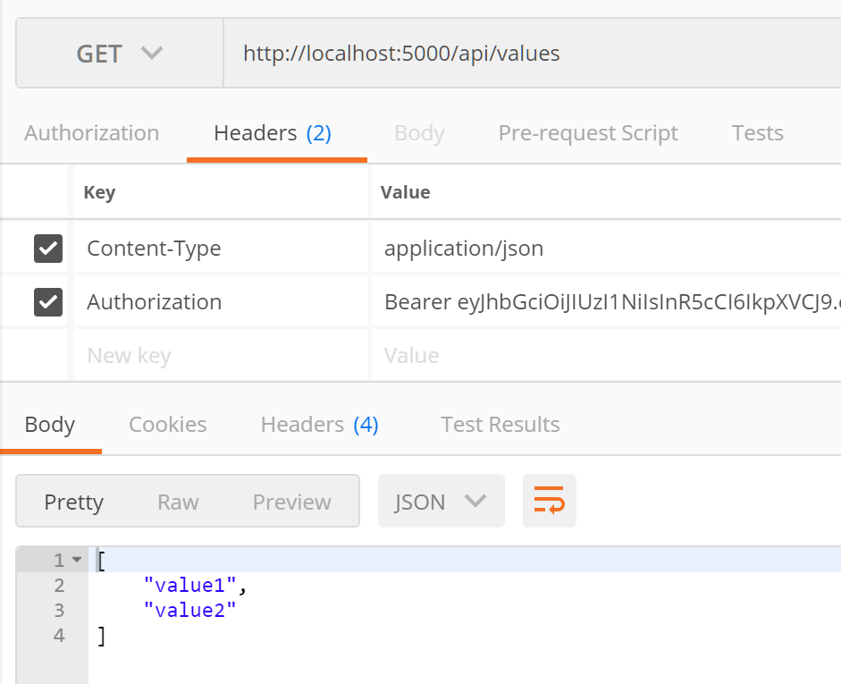

# aspnetcore-webapi-jwt

This repository shows a reference implementation of Asp .Net Core 2.0 Web API secured by Asp .Net Identity and JWT authentication. Following is a setp by step instruction if you want to do it all yourself.

## Create Initial Web Api Project and add Necessary Tooling

```
mkdir JwtApi

cd JwtApi

dotnet new webapi

code .
```

Enable the vscode build & debug configuration 


```
dotnet restore
```

Next, let's add following packages to our Web API project.

```
dotnet add package Microsoft.EntityFrameworkCore.Tools --version 2.0.1

dotnet add package Microsoft.EntityFrameworkCore.Sqlite --version 2.0.1

dotnet add package Microsoft.EntityFrameworkCore.Tools.DotNet --version 2.0.1
```

Open the .csproj file and add following Package and CLiToolReference. Unfortunately there is no CLI support yet to add CLiToolReference item using command line.

```
<DotNetCliToolReference Include="Microsoft.EntityFrameworkCore.Tools.DotNet" Version="2.0.1" />
```

Next restore newly referred packages with `dotnet restore`


## Add Asp .Net Identity and Configure SqLite as a DataStore

Add a new ApplicationUser.cs file as below.

```
using System;
using Microsoft.AspNetCore.Identity;

namespace AspnetCoreWebApiJwt.Models
{
    public class ApplicationUser : IdentityUser
    {
        public string FirstName { get; set; }
        public string LastName { get; set; }
        public string Url {get;set;}
    }
}
```

Add ApplicationDbContext.cs file as below.

```
using AspNetCoreWebApiJwt.Models;
using Microsoft.AspNetCore.Identity.EntityFrameworkCore;
using Microsoft.EntityFrameworkCore;

namespace AspNetCoreWebApiJwt.Data
{
    public class ApplicationDbContext : IdentityDbContext<ApplicationUser>
    {
        public ApplicationDbContext(DbContextOptions options)
              : base(options)
        {
        }
    }
}
```

Wrre up Asp .Net Identity and ApplicationDbContext under ConfigureServies method in Startup.cs file.

```
        public void ConfigureServices(IServiceCollection services)
        {
            services.AddMvc();
            
            //Configure EF Core DbContext for SqLite Database
            services.AddDbContext<ApplicationDbContext>(options =>
                        options.UseSqlite("Filename=./AspnetCoreWebApiJwt.db"));

            
            //Setup Asp .Net Identity With Options
            var builder = services.AddIdentityCore<ApplicationUser>(o =>
            {
                // configure identity options
                o.Password.RequireDigit = false;
                o.Password.RequireLowercase = true;
                o.Password.RequireUppercase = true;
                o.Password.RequireNonAlphanumeric = false;
                o.Password.RequiredLength = 6;
            });
            builder = new IdentityBuilder(builder.UserType, typeof(IdentityRole), builder.Services);
            builder.AddEntityFrameworkStores<ApplicationDbContext>().AddDefaultTokenProviders();
            services.AddAutoMapper();
        }
```

Head over to your Command prompt and Add/Enabble Initial migration and Update database. In our case, if everything works as expected it should generate AspnetCoreWebApiJwt.db file.

```
dotnet ef migrations add initial

dotnet ef database update
```

## Add AccountController and ActitonMethod to Register a new User

Add AccountsController.cs file and update the conent as below.

```
namespace AspNetCoreWebApiJwt.Controllers
{
   [Route("api/[controller]")] 
    public class AccountsController : Controller
    {
        private readonly UserManager<ApplicationUser> _userManager;
        private readonly IMapper _mapper;

        public AccountsController(UserManager<ApplicationUser> userManager, IMapper mapper, 
                                  ApplicationDbContext appDbContext)
        {
            _userManager = userManager;
            _mapper = mapper;
         }

        // POST api/accounts
        [HttpPost]
        public async Task<IActionResult> Post([FromBody]RegisterViewModel model)
        {
            if (!ModelState.IsValid)
            {
                return BadRequest(ModelState);
            }
            try
            {
            var userIdentity = _mapper.Map<ApplicationUser>(model);
            var result = await _userManager.CreateAsync(userIdentity, model.Password);
            if (!result.Succeeded) return new BadRequestObjectResult("Error creating account");
            return new OkObjectResult("Account created");
            }
            catch(Exception ex)
            {
                 return new BadRequestObjectResult("Error creating account");
            }
        }
    }
}
```

The Register method makes use of couple of things, namely The RegisterViewModel and Automapper configuration. 

Add **RegisterViewModel.cs** file.

```
namespace AspNetCoreWebApiJwt.ViewModels
{
    public class RegisterViewModel
    {
        public string Email { get; set; }
        public string Password { get; set; }
        public string FirstName { get; set; }
        public string LastName { get; set; }
        public string Url { get; set; }
    }
}
```

Add Automapper configuration. I will place it under Infrastructure folder for time being.

```
namespace AspNetCoreWebApiJwt.Infrastructure
{
    public class ViewModelToEntityMappingProfile : Profile
    {
        public ViewModelToEntityMappingProfile()
        {
            CreateMap<RegisterViewModel, ApplicationUser>().
            ForMember(au => au.UserName, map => map.MapFrom(vm => vm.Email));
        }
    }
}
```

Let's test our new Registration routine. Run our Web API project and Fire up POSTMAN or similar tool to issue a POST request to our Backend. 



As long as you receieve message that account was creaated, everything is working as expected. Also verify the newly created account in the SqLite Database.

Finally, let's move to the lalst phase of our sample where we are going to wire up JWT Authentication Schema and secure our Web API using token based Authenticataion.

## Integrate JWT

Create a new Class to store all the JWT authentication settings from our Conifugration file.

```
using System;
using System.Threading.Tasks;
using Microsoft.IdentityModel.Tokens;

namespace AspNetCoreWebApiJwt.Infrastructure
{
    public class JwtIssuerOptions
    {
        public string Issuer { get; set; }
        public string Subject { get; set; }
        public string Audience { get; set; }
        public DateTime Expiration => IssuedAt.Add(ValidFor);
        public DateTime NotBefore { get; set; } = DateTime.UtcNow;
        public DateTime IssuedAt { get; set; } = DateTime.UtcNow;
        public TimeSpan ValidFor { get; set; } = TimeSpan.FromMinutes(120);
        public Func<Task<string>> JtiGenerator =>
          () => Task.FromResult(Guid.NewGuid().ToString());
        public SigningCredentials SigningCredentials { get; set; }
    }
}
```

Next, let's add the configuration settings for JwtIssuer.

```
  "JwtIssuerOptions": {
    "Issuer": "webApi",
    "Audience": "http://localhost:5000/"
  },
```

Declare following two Variabbles on your Startup.cs class.

```
    private const string SecretKey = "Replace  This With Some Super Secret Key";
    private readonly SymmetricSecurityKey _signingKey = new SymmetricSecurityKey(Encoding.ASCII.GetBytes(SecretKey));
```

Update ConfigureServices Method of Startup.cs file to Read and set JwtIssuer settings.

```
           //Read JwtIssuerOpotions From Config
            var jwtAppSettingOptions = Configuration.GetSection(nameof(JwtIssuerOptions));

            // Configure JwtIssuerOptions
            services.Configure<JwtIssuerOptions>(options =>
            {
                options.Issuer = jwtAppSettingOptions[nameof(JwtIssuerOptions.Issuer)];
                options.Audience = jwtAppSettingOptions[nameof(JwtIssuerOptions.Audience)];
                options.SigningCredentials = new SigningCredentials(_signingKey, SecurityAlgorithms.HmacSha256);
            });
```

Next, define Validation Parameters for JWT Token and Register JWT Authentication as a Middleware.

```
            var tokenValidationParameters = new TokenValidationParameters
            {
                ValidateIssuer = true,
                ValidIssuer = jwtAppSettingOptions[nameof(JwtIssuerOptions.Issuer)],

                ValidateAudience = true,
                ValidAudience = jwtAppSettingOptions[nameof(JwtIssuerOptions.Audience)],

                ValidateIssuerSigningKey = true,
                IssuerSigningKey = _signingKey,

                RequireExpirationTime = false,
                ValidateLifetime = true,
                ClockSkew = TimeSpan.Zero
            };

            services.AddAuthentication(options =>
            {
                options.DefaultAuthenticateScheme = JwtBearerDefaults.AuthenticationScheme;
                options.DefaultChallengeScheme = JwtBearerDefaults.AuthenticationScheme;

            }).AddJwtBearer(configureOptions =>
            {
                configureOptions.ClaimsIssuer = jwtAppSettingOptions[nameof(JwtIssuerOptions.Issuer)];
                configureOptions.TokenValidationParameters = tokenValidationParameters;
                configureOptions.SaveToken = true;
            });
```

Let's add following lines in Configure method of Startup.cs file

```
    app.UseAuthentication();
    app.UseDefaultFiles();
    app.UseStaticFiles();
```

Finally, let's create a Token endpoint wher user can post his/her credentials to Generate Access Token.

```
        // POST api/accounts/token
        [HttpPost("token")]
        public async Task<IActionResult> Post([FromBody]LoginViewModel loginViewModel)
        {
            if (!ModelState.IsValid)
            {
                return BadRequest(ModelState);
            }

            //Find user by Username
            var userToVerify = await _userManager.FindByNameAsync(loginViewModel.Username);
            if (userToVerify == null)
            {
                return BadRequest(ModelState);
            }
            //If User is found, let's verify Username/Password Pari
            var isValid = await _userManager.CheckPasswordAsync(userToVerify, loginViewModel.Password);
            if (isValid)
            {

                var claims = new[]
                    {
                    new Claim(ClaimTypes.NameIdentifier, userToVerify.Id),
                    new Claim(JwtRegisteredClaimNames.Sub, userToVerify.UserName),
                    new Claim(JwtRegisteredClaimNames.Jti, Guid.NewGuid().ToString())
                    };

                var jwt = new JwtSecurityToken(
                            issuer: _jwtOptions.Issuer,
                            audience: _jwtOptions.Audience,
                            claims: claims,
                            notBefore: _jwtOptions.NotBefore,
                            expires: _jwtOptions.Expiration,
                            signingCredentials: _jwtOptions.SigningCredentials);

                var encodedJwt = new JwtSecurityTokenHandler().WriteToken(jwt);
                var response = new
                {
                    id = userToVerify.Id,
                    auth_token = encodedJwt,
                    expires_in = (int)_jwtOptions.ValidFor.TotalSeconds
                };
                return new OkObjectResult(response);
            }
            else
            {
                return BadRequest("Invalid username or password.");
            }
        }
```

Add new LoginViewModel.cs

```
using System.ComponentModel.DataAnnotations;

namespace AspNetCoreWebApiJwt.ViewModels
{    
    public class LoginViewModel
    {
        [Required]
        public string Username { get; set; }
        [Required]
        public string Password { get; set; }
    }
}
```


Request an Access Token



Pass the Token to request Secure Controller. Here it's the default ValuesController which is decorated with **[Authorize]** attirbute.



At this point, we havev a Basic Asp .Net Core Web API secured via Asp .Net Identity and JWT authentication. 

